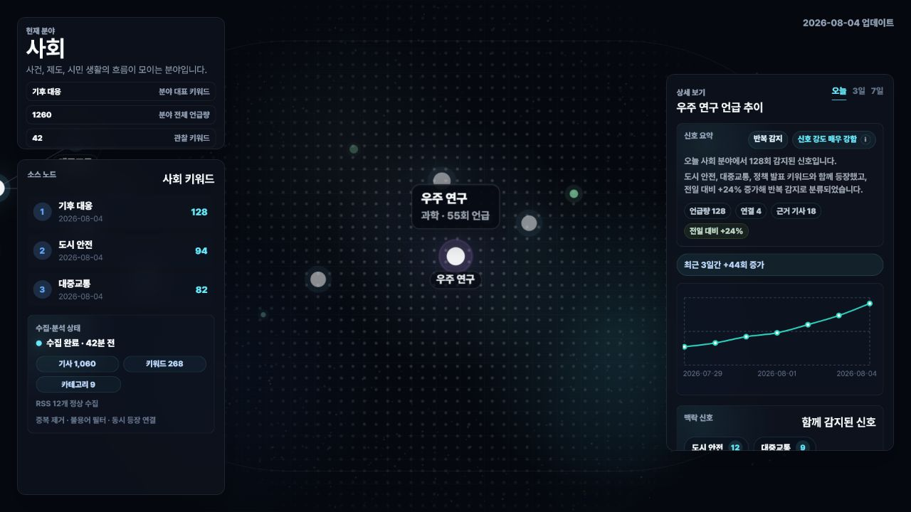

# TrendRadar

An RSS news pipeline and dashboard for exploring keyword trends, related articles, and keyword relationships.

[Demo](https://trend-radar-sandy.vercel.app/) · [Portfolio](https://sooyeon-developer-portfolio.vercel.app/)

## Overview

A keyword ranking alone does not explain what is driving the news. TrendRadar collects RSS headlines, extracts Korean keywords, and groups their mentions by date and category. The dashboard connects changes in keyword frequency with related terms and source articles so users can inspect the evidence behind a trend.

## Features

- Collect RSS headlines across nine categories and deduplicate articles by URL.
- Extract Korean nouns with `kiwipiepy`, remove source names and stopwords, and fall back to rules when the package is unavailable.
- Explore keyword counts over one, three, or seven days, recent changes, related articles, and co-occurring keywords.
- Display collection status, article counts, and failed feed counts from pipeline run records.
- Schedule collection through GitHub Actions at 09:17 KST daily; actual start times can vary.
- Remove articles and daily trend records outside the latest seven calendar days at the start of each crawl. This is crawler-driven cleanup, not a MongoDB TTL index; pipeline run records are not included in this cleanup.

## Tech Stack

| Layer | Technologies | Purpose |
| --- | --- | --- |
| Collection | Python, feedparser, kiwipiepy, PyMongo | RSS ingestion, keyword extraction, and persistence |
| Storage | MongoDB | Articles, daily keyword counts, and pipeline run records |
| API | Node.js, Express, Mongoose | Aggregation and trend queries |
| UI | React, Vite, Recharts, SVG | Filters, charts, keyword relationships, and article details |
| Automation | GitHub Actions | Scheduled collection and stored-data checks |

## Architecture

```text
RSS feeds → Python crawler → MongoDB → Express API → React dashboard
                                 ↑
                     Articles, trends, pipeline runs
```

The crawler stores articles and daily keyword counts. The API combines records for the selected period and category, while the UI computes rule-based signal summaries. Pipeline records keep collection results separate from dashboard queries. If the API loses its database connection, later requests retry the connection; unavailable requests return `503 DATABASE_UNAVAILABLE` with a `Retry-After` header.

Code entry points:

- [Collection, keyword extraction, and retention](crawler/crawler.py)
- [Trend and relationship queries](backend/routes/trendRoutes.js)
- [Database connection and retry handling](backend/database.js)
- [Signal scoring and explanations](frontend/src/utils/signalAnalysis.js)

## Getting Started

Use Node.js 22.12+ and Python 3.12, with access to MongoDB. Run each block from the repository root in a separate terminal.

### 1. Configure and start the API

```bash
cd backend
cp .env.example .env
npm ci
npm run dev
```

Before starting the API, replace `MONGO_URI` in `backend/.env` with your connection string **including the database name**, and set `MONGO_DB` to that same name. For example, use `/trend-radar` in the URI and `MONGO_DB=trend-radar`. The API selects the database from the URI; the crawler selects it from `MONGO_DB`. Keep these aligned and leave credentials out of Git. In PowerShell, `Copy-Item .env.example .env` can replace `cp`.

### 2. Collect data

```bash
cd crawler
python -m venv .venv
# macOS / Linux
.venv/bin/python -m pip install -r requirements.txt
.venv/bin/python crawler.py
```

On Windows PowerShell:

```powershell
cd crawler
python -m venv .venv
.venv\Scripts\python -m pip install -r requirements.txt
.venv\Scripts\python -m pip install tzdata
.venv\Scripts\python crawler.py
```

The Windows command installs IANA timezone data used by `ZoneInfo("Asia/Seoul")`. Run the crawler from `crawler/` so it reads `../backend/.env`. Each run applies the seven-day cleanup to the configured database before collecting data.

### 3. Start the UI

```bash
cd frontend
npm ci
npm run dev
```

The UI uses `http://localhost:4000` for the API during development. Set `VITE_API_ORIGIN` in `frontend/.env.local` if the API runs elsewhere. In production, the default is the current origin.

## Checks

Run from the repository root:

```bash
npm test --prefix backend
npm test --prefix frontend
npm run lint --prefix frontend
npm run build --prefix frontend
```

These cover connection handling and signal calculations. A complete collection run also requires RSS access and a configured MongoDB database.

## Deployment

The Vercel configuration defines separate frontend and backend services and routes `/api/*` to Express. Set the backend `MONGO_URI` with the database name. For scheduled collection, configure GitHub Actions secrets `MONGO_URI` and `MONGO_DB` for the same database; see the workflow in [`.github/workflows/`](.github/workflows/).

Selected API routes:

```text
GET /api/health
GET /api/pipeline/status
GET /api/trends/galaxies?days=1
GET /api/trends/top?days=7&category=society
GET /api/trends/:keyword?category=society
GET /api/trends/related/:keyword?category=society
GET /api/trends/articles/:keyword?category=society
GET /api/trends/rising?category=society
GET /api/trends/network?days=7&category=society
```

## Screenshots



## Limitations

- Analysis uses RSS headlines, not full article text.
- Signal scores are rules based on mentions and related data, not forecasts from a trained model.
- Feed availability and editorial choices affect category coverage.
- Retention cleanup depends on crawler execution; it does not run independently in MongoDB.

## Links

[Demo](https://trend-radar-sandy.vercel.app/) · [Portfolio](https://sooyeon-developer-portfolio.vercel.app/)
